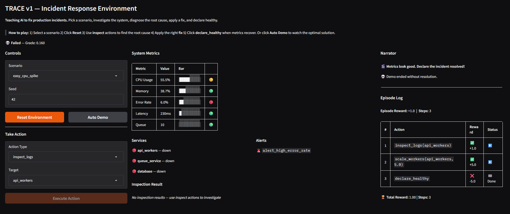

# Trace

So here's the deal: your AI agent wakes up at 3 AM to a production incident. It sees some dashboards blinking red, but doesn't know what's actually wrong.



TRACE teaches the agent to:
- **Look at the dashboards** (CPU, memory, error rates)
- **Dig into the logs** (inspect_logs = ask "what happened?")
- **Figure out the root cause** (by trying fixes and seeing if they work)
- **Fix it** (restart services, scale up workers, etc.)

## The Twist

This isn't an easy game. We made it realistic:

✅ **Agent can't just see everything** — logs and deep metrics are hidden. You gotta ask for them.
✅ **Every scenario is the same if you replay it** — no randomness to hide behind  
✅ **Actions are structured** — every fix needs a target (e.g., `api_workers`)  
✅ **Rewards build up** — one bad decision doesn't break everything immediately  
✅ **We only grade on results** — did you fix it in time? That's what matters.  

## Get It Running

**Setup** (one time):
```bash
python -m venv venv
./venv/Scripts/activate  # Windows
pip install -e .
```

**Then**:
```bash
# Terminal 1: Start the server
uvicorn server.app:app --host 0.0.0.0 --port 7860

# Terminal 2: Run tests to make sure it works
pytest tests/ -v

# Terminal 3: Try the demo agent
python inference.py
```

## What's Inside 📦

```
TRACE/
├── pyproject.toml         # Project config (OpenEnv wants this)
├── openenv.yaml           # Tells OpenEnv how to run us
├── Dockerfile             # For containerization
├── README.md              # This file
│
├── server/                # The API server
│   └── app.py             # Actually runs /reset, /step, /state, /health
│
├── trace/                 # The environment logic
│   ├── models.py          # Data structures
│   ├── scenarios.py       # The 3 incidents
│   ├── simulator.py       # Runs the scenario step by step
│   ├── rewards.py         # Calculates points
│   └── graders.py         # Final score
│
├── tests/                 # Everything's tested
│   ├── test_scenarios.py  # Do scenarios work?
│   ├── test_rewards.py    # Do points work?
│   └── test_env.py        # Does the whole thing work?
│
└── inference.py           # Demo: how an agent would play
```

## Three Incidents to Solve

### 1. Easy: The Traffic Spike (5 steps max)

Your API is getting crushed. CPU is maxed out. Something's overloaded.

**What you see:** CPU at 85%, latency jumping, errors starting  
**What you don't see:** It's just too much traffic  
**What to do:** Add more workers (`scale_workers`)

---

### 2. Medium: The Cascade (7 steps max)

Your queue service has a memory leak. As memory fills up, it starts dropping requests. Other services timeout waiting for it. Everything falls apart together.

**What you see:** Queue backing up, workers getting slower, more errors  
**What you don't see:** There's a memory leak you need to restart to fix  
**What to do:** Restart the queue service

---

### 3. Hard: The Two-Problem Incident (8 steps max)

Someone deployed new code that queries the database inefficiently. Now the DB connection pool is exhausted. Plus there's a high CPU spike that's... actually a symptom, not the problem.

**What you see:** Tons of errors, crazy high latency, CPU spike, DB is slow  
**What you don't see:** The deploy broke the queries, and the pool is full  
**What to do:** Restart the database (and maybe rollback the release)  

## API (How to Talk to TRACE)

### Start an incident
```bash
POST /reset
{"task_id": "easy_cpu_spike", "seed": 42}
→ You get the first observation (dashboards showing the problem)
```

### Take an action
```bash
POST /step
{"action": {"action_type": "scale_workers", "target": "api_workers", "value": 5}}
→ You get the new state, points earned this step, and whether it's fixed
```

### Check status anytime
```bash
GET /state
→ Current dashboards, points so far, step count
```

### Is the server alive?
```bash
GET /health
→ {"status": "healthy"}
```

## How Scoring Works 

**You get points for smart moves**, deductions for dumb ones. But points don't count until the episode ends (no cliff-falling mid-incident).

**During the incident:**
- +1 for asking smart questions (logging, metrics checks)
- +5 for actually fixing something
- -0.5 for doing the same thing twice
- -2 for making things worse
- +10 for successfully resolving it
- -5 if you claim it's fixed but it's not

**Final score:**
```
Did you fix it?           → 60% of score
How fast did you fix it?  → 40% of score
```

So speed matters, but not as much as actually *fixing* things.

## Deploy It

**Local** (for testing):
```bash
docker build -t trace:latest .
docker run -p 7860:7860 trace:latest
```

**To the cloud** (Hugging Face Spaces):
Push to the `meta-trace` repo and enable auto-deploy. Done.

---

## Check If It Works

```bash
openenv validate  # Does the API work?
./validate-submission.sh  # Full checks
```

Should see:
- ✅ Server comes up  
- ✅ Scenarios work and are reproducible  
- ✅ Rewards actually accumulate  
- ✅ Agent can fix incidents  
- ✅ Tests pass    

---

**Want the deep dive?** See [agent.md](agent.md).

**Ready to build?** `pip install -e .` and go! 